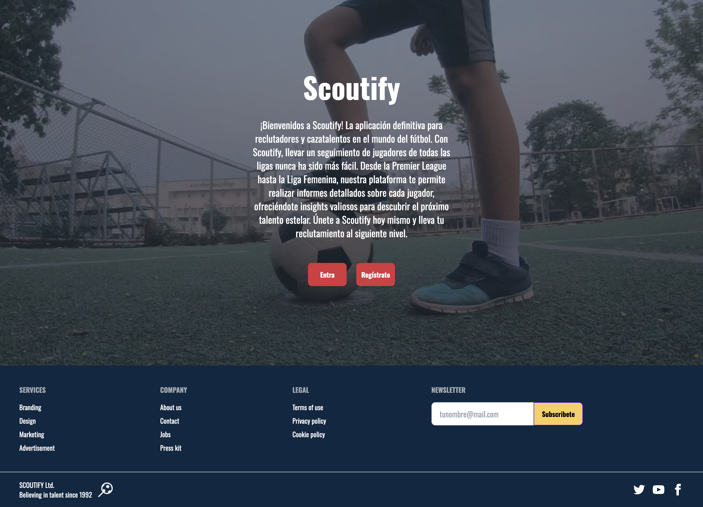
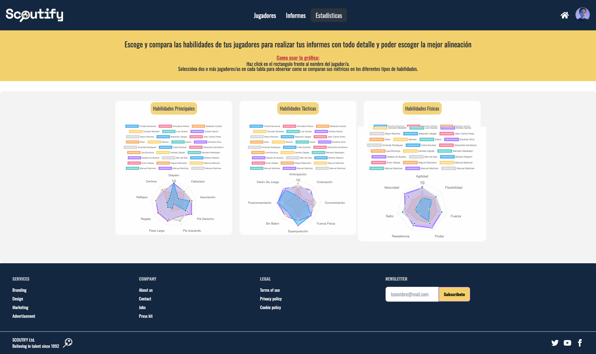

¡Bienvenido a Scoutify! Esta aplicación está diseñada específicamente para reclutadores y cazatalentos en el mundo del fútbol. Scoutify simplifica el seguimiento de jugadores en diversas ligas, te permite crear informes detallados de cada partido y jugador para que lo tengas todo bajo control ¿Te parece poco? Nuestra aplicación tambien cuenta con un comparador de estadisticas de todos los jugadores disponibles.

## Asi se ve nuestra web :soccer:






## Como empezar :rocket:

### Instalación

Para comenzar a usar nuestra aplicación en tu entorno local, sigue estos pasos:

#### Clona el repositorio:

```bash
git clone https://github.com/ScouzPro/ScouzPro.git
```

#### Instala las dependencias:

```bash
cd scouzpro/frontend
npm install

cd scouzpro/backend
npm install
```

#### Inicia el servidor:

##### En backend:

```bash
nodemon start
```

##### En frontend

```bash
ng build
ng serve
```

Finalmente, abre tu navegador web y visita [http://localhost:4200](http://localhost:4200)

## Features
Nuestra aplicación ofrece las siguientes funcionalidades principales:

- Registro de Jugadores: Los reclutadors pueden registrar nuevos fichajes en la plataforma y proporcionar detalles sobre su historial deportivo, habilidades y estadísticas.

- Creación de informes: Los ojdeadores pueden realizar varios informes sobre cada jugador, calificando su desempeño en cada partido

- Gestión de Perfiles: Los reclutadores pueden gestionar los perfiles de los jugadores, agregar comentarios, realizar seguimientos y calificar el potencial de los jugadores.

- Registro estatístico: La aplicación cuenta con una gáfica comparativa de habilidades entre jugadores, además de una vista gráficapor cada jugadores de sus registros de habilidad.

- Seguridad: La seguridad de los datos de los usuarios es una prioridad. Implementamos medidas de seguridad robustas para proteger la información confidencial.
## Tech Stack :cd:
Nuestra aplicación utiliza el siguiente stack tecnológico:

**Design:**  

**Client:**  

**Frameworks/Libraries:**
 

**Lenguage:**    

**Server:**  

**Testing:**  
## Desarrolladores :trophy:

- :man_technologist: [@JeanCarlosPerez](https://github.com/JeanCarlosPerez) como Scrum Master

- :woman_technologist: [@DenaRi97](https://github.com/DenaRi97) como Product Owner

- :man_technologist: [@eduardof5sg](https://github.com/eduardof5sg)

- :woman_technologist: [@DANIELAZAPATA0724](https://github.com/DANIELAZAPATA0724)

- :woman_technologist: [@angarce25](https://github.com/angarce25)

## ¡Gracias!

## Documentación

:art:[Figma](https://www.figma.com/file/vLIheYKJB9lvBT8WcwNyfL/ScouzPro?type=design&node-id=0%3A1&mode=design&t=aOTNPTg4N8qUA3tE-1):card_index_dividers:[Trello](https://trello.com/b/0XztzvWY/scouz-pro):desktop_computer:[Repo](https://github.com/ScouzPro/ScouzPro)
## ¡Gracias por usar Scoutify! Si tienes alguna pregunta o sugerencia, no dudes en ponerte en contacto con nosotros. ¡Que disfrutes reclutando talentos futbolísticos! :soccer:

